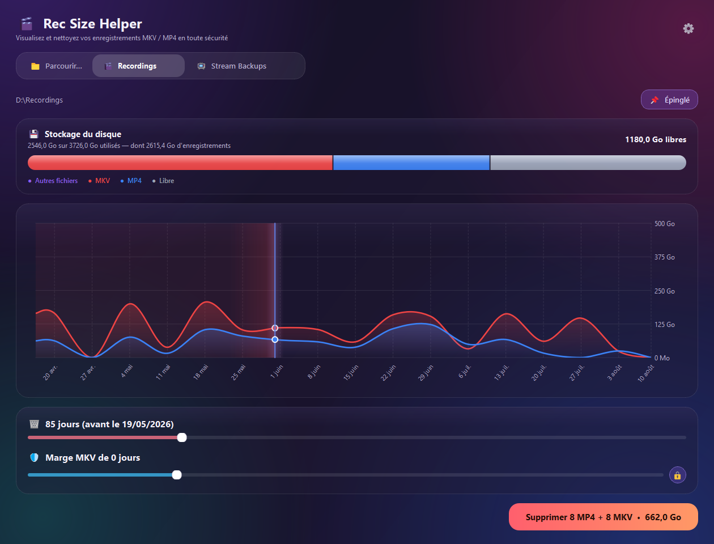
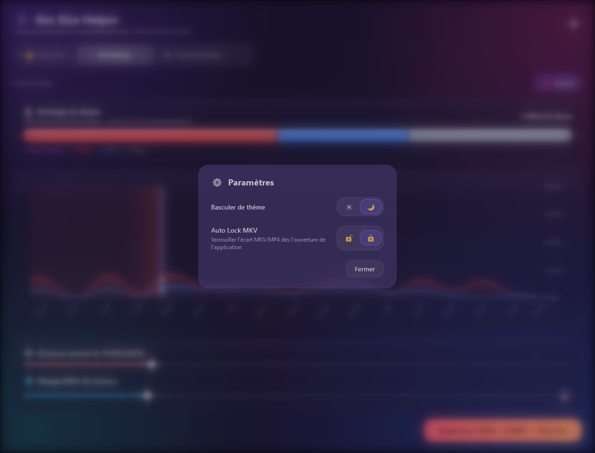
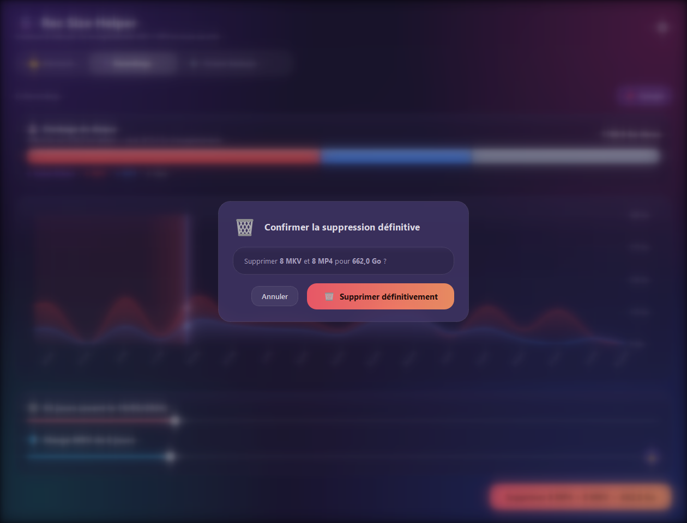

<div align="center">


# Rec Size Helper

Visualise et nettoie tes enregistrements **MKV / MP4** volumineux, sans jamais perdre le fil de ce qui est récupérable ou non.

[**⬇ Télécharger pour Windows**](https://github.com/StundZow/rec-size-helper/releases/latest/download/RecSizeHelperSetup.exe) · [Releases](https://github.com/StundZow/rec-size-helper/releases)



</div>

## Ce que ça fait

Rec Size Helper s'adresse aux créateurs qui enregistrent en MKV puis convertissent en MP4 : tu te retrouves avec deux copies de chaque enregistrement, et un disque qui se remplit sans qu'on voie vraiment où part l'espace.

L'appli scanne un dossier, trace une courbe MKV/MP4 semaine par semaine, et te laisse choisir jusqu'à quand supprimer avec un curseur — tout en gardant une **marge de sécurité** sur les MKV, au cas où tu doives reconvertir un vieux fichier avant de le perdre pour de bon.

## Pourquoi pas juste trier les fichiers à la main ?

Parce qu'il faut croiser deux formats, deviner quels MP4 ont déjà été convertis, calculer combien ça libère, et refaire tout ça à chaque nettoyage. Ici c'est un curseur et un bouton — l'appli fait le calcul et te montre l'effet *avant* de supprimer quoi que ce soit.

## Fonctionnalités

- 📈 **Courbe MKV/MP4 semaine par semaine**, avec zones colorées qui montrent exactement ce que la suppression va toucher
- 🛡️ **Marge de sécurité MKV** indépendante de la coupure MP4, verrouillable en un clic
- 💾 **Barre de stockage** façon iOS — MKV / MP4 / autres fichiers / libre, avec aperçu en direct avant de valider
- 🗑️ **Suppression définitive**, sans passer par la Corbeille (l'espace annoncé reste donc toujours exact)
- 📌 **Dossiers épinglés**, réorganisables, avec nom et icône personnalisables, pour accéder d'un clic à tes emplacements habituels
- 🌗 **Thème clair / sombre**, synchronisé avec Windows ou choisi manuellement
- 🔄 **Mise à jour automatique** intégrée — plus besoin de repasser par l'installateur

<div align="center">

&nbsp;&nbsp;

</div>

## Prise en main

1. [Télécharge `RecSizeHelperSetup.exe`](https://github.com/StundZow/rec-size-helper/releases/latest/download/RecSizeHelperSetup.exe) et lance-le — pas besoin d'être administrateur.
2. Deux cases à cocher (icône sur le Bureau, lancer l'application à la fin), et un emplacement d'installation modifiable si tu veux changer le chemin par défaut.
3. Une fois l'appli ouverte, clique **📁 Parcourir…** pour choisir le dossier de tes enregistrements. Épingle-le (📌) pour y revenir en un clic la prochaine fois.
4. Ajuste les deux curseurs — jusqu'à quand supprimer, et la marge de sécurité MKV — puis vérifie l'aperçu de la barre de stockage avant de valider.

*(Un `RecSizeHelper-portable.exe` est aussi disponible sur la page des releases si tu préfères ne rien installer.)*

## Comment ça marche

L'installateur télécharge directement la dernière version depuis les releases GitHub au moment de l'installation — il n'embarque rien lui-même, ce qui le garde léger. L'appli elle-même vérifie les nouvelles versions à chaque lancement et propose une mise à jour en un clic quand il y en a une.

## Lancer depuis les sources

```bash
pip install -r requirements.txt
python main.py
```

## Publier une nouvelle version (pour les mainteneurs)

```bash
python release.py 1.5 "Description des changements"
```

Ce script reconstruit les exécutables, tague la version, et publie la release sur GitHub. Nécessite [GitHub CLI](https://cli.github.com/) authentifié.
