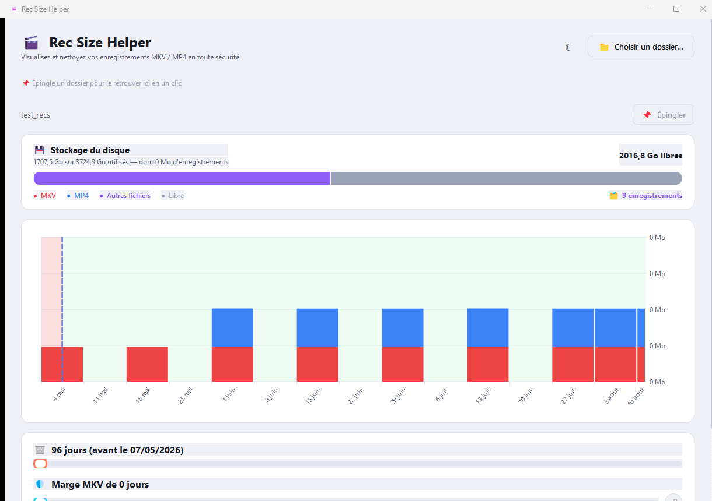

# 🎬 Rec Size Helper

Une petite application Windows pour visualiser et nettoyer tes enregistrements **MKV / MP4** volumineux, sans jamais perdre le fil de ce qui est récupérable ou non.

Pensée pour les créateurs qui enregistrent en MKV puis convertissent en MP4 : l'appli t'aide à voir en un coup d'œil combien d'espace prennent tes archives, et à supprimer les plus anciennes en gardant une marge de sécurité sur les MKV (au cas où tu doives reconvertir).



## Installation

1. Va dans l'onglet [Releases](https://github.com/StundZow/rec-size-helper/releases/latest).
2. Télécharge `RecSizeHelper.exe`.
3. Double-clique dessus. Aucune installation, aucune dépendance nécessaire.

L'application se met à jour toute seule : à chaque nouvelle version publiée ici, une popup te propose de l'installer en un clic.

## Fonctionnalités

- **Barre de stockage** façon iOS — répartition MKV / MP4 / autres fichiers / libre, avec aperçu en direct de l'effet d'une suppression avant de valider.
- **Frise chronologique** semaine par semaine, avec l'axe des Go à droite, pour voir où partent réellement les Go.
- **Deux curseurs** : un pour choisir jusqu'à quand supprimer, un pour garder une marge de sécurité supplémentaire sur les MKV — avec un cadenas pour les synchroniser.
- **Suppression définitive**, sans passer par la Corbeille (l'espace annoncé est donc toujours exact).
- **Dossiers épinglés**, réorganisables, pour accéder d'un clic à tes emplacements d'enregistrement habituels.
- **Thème clair / sombre**, synchronisé avec le thème Windows.
- **Mise à jour automatique** intégrée.

## Lancer depuis les sources

```bash
pip install -r requirements.txt
python main.py
```

## Publier une nouvelle version (pour les mainteneurs)

```bash
python release.py 1.1 "Description des changements"
```

Ce script reconstruit l'exécutable, tague la version, et publie la release sur GitHub. Nécessite [GitHub CLI](https://cli.github.com/) authentifié.
